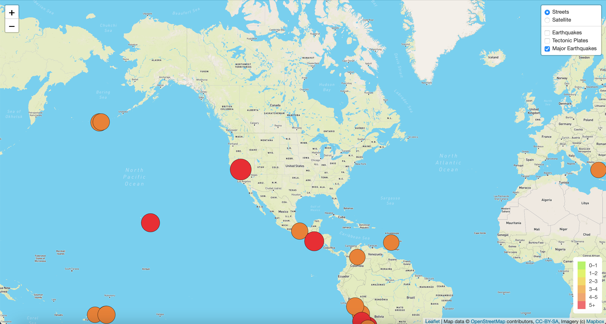

# Mapping_Earthquakes

## Overview of Project

In this project, we are required to build interactive features on earthquakes from around the world by retrieving the GeoJSON earthquake data using JavaScript, D3, and Leaflet libraries from the US Geological Survey Website and to plot the data on a Mapbox map through an API request.

### Purpose

The purpose of this project is to add tectonic plates data to the previously created map in order to visualize the earthquake data in relation to the tectonic plates' location on the earth. Additionally, we are required to add major earthquake data with magnitudes greater than 4.5 on the map.

## Resources

- Data Sources: [GeoJSON PB2002 Boundries](https://raw.githubusercontent.com/fraxen/tectonicplates/master/GeoJSON/PB2002_boundaries.json), [M4.5+ Earthquakes](https://earthquake.usgs.gov/earthquakes/feed/v1.0/summary/4.5_week.geojson).

## Results

This section of the project focuses on the results achieved after adding the tectonic and major earthquakes data to the map.

### Tectonic Plate Data

In this portion of the project, knowledge of JavaScript, Leaflet.js and GeoJSON data were used for adding the tectonic plates' data and calling the data from [GeoJSON PB2002 Boundries](https://raw.githubusercontent.com/fraxen/tectonicplates/master/GeoJSON/PB2002_boundaries.json) using **d3.json()**. Furthermore, the data was added to the map using the geoJSON() layer and to the overlay object as shown in the figure below.

### Major Earthquake Data

In this portion of the project, major earthquake data which was retrieved from the [M4.5+ Earthquakes](https://earthquake.usgs.gov/earthquakes/feed/v1.0/summary/4.5_week.geojson) was added to the map using the **d3.json()**. Additionally, the color and radius of each earthquake was set based on the magnitude of the earthquakes. Lastly, a popup marker displaying the magnitude and location of the earthquake was added to each earthquake using GeoJSON layer as illustrated in the figures below.

*Major Earthquake Data:*

*Popup Marker Displaying the Magnitude and Location of Earthquake:*

### Additional Map

Lastly, the plot was updated by adding another option of the Mapbox style, **dark-v10**, as a tile layer object to the map as demonstrated in the figure below.

## Summary

In conclusion, the project was successfully completed by creating a map that visually showed the differences between the magnitudes of the earthquakes all around the world. The plot was then updated by implementing additional data such as the tectonic plates' data which is useful in viewing the earthquake data in relation to the tectonic plate's location on the earth. Furthermore, major earthquakes data having magnitudes of greater than 4.5 were added to the map as well.

